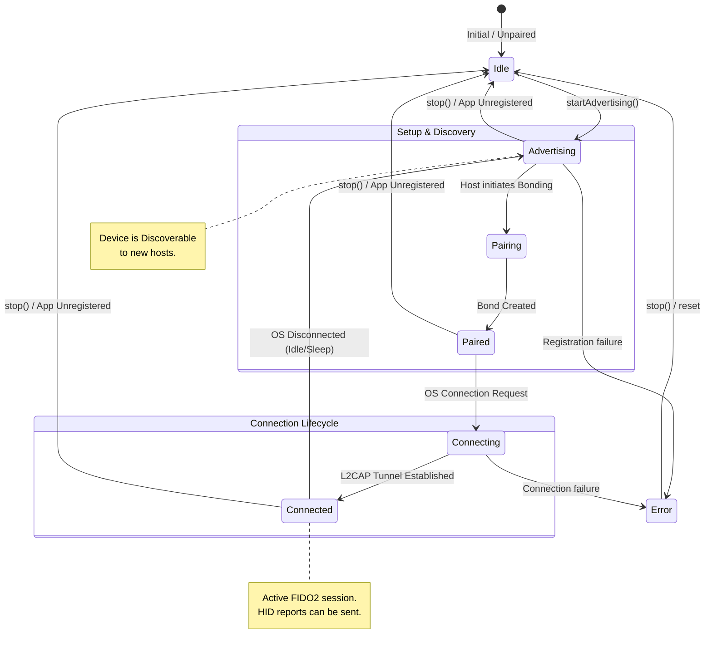

# Bluetooth HID State Machine

This document defines the high-level state machine for the Chimali Bluetooth HID Authenticator. It maps the Android `BluetoothHidDevice` states to the logical FIDO2 authenticator lifecycle.

## State Diagram

## State Definitions

| State | Description |
| :--- | :--- |
| **Idle / Unpaired** | Initial state. No Bluetooth profiles are active or registered. |
| **Advertising** | The HID app is registered and the device is **Discoverable**. Ready for initial pairing or reconnection. |
| **Pairing** | The temporary state during the Bluetooth bonding handshake. |
| **Paired / Disconnected** | The device is bonded with a host (e.g., Windows) but the active L2CAP HID channel is closed. |
| **Connecting** | The host has initiated a connection to the HID profile (L2CAP handshake in progress). |
| **Connected** | The active state. The FIDO2 tunnel is established and HID reports (FIDO2 commands) are being exchanged. |
| **Error** | An unrecoverable error occurred during HID profile registration or connection. |

## Transitions

- **startAdvertising()**: Registers the HID SDP record and makes the device discoverable.
- **Pairing Success**: Moves from discovery to a stable bonded state (`Paired`).
- **OS Connection**: Windows/Android OS typically manages the connection lifecycle automatically once paired.
- **OS Disconnected**: When the active L2CAP channel drops, the device immediately transitions back to `Advertising` to listen for future connections.
- **stop()**: Unregisters the HID application and returns the device to a dormant `Idle` state.
