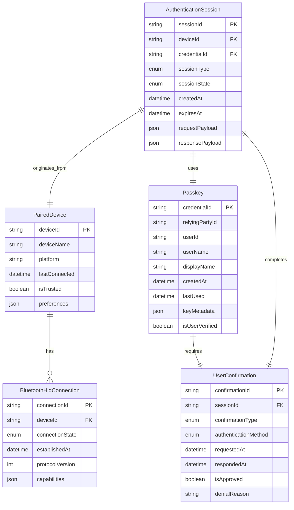

# Data Model: FIDO2 Virtual Authenticator

**Date**: 2025-02-25  
**Status**: Design Complete  
**Phase**: 1 - Data Modeling & Architecture

## Entity Relationship Overview

## Detailed Entity Definitions

### PairedDevice

Represents a desktop system that has been paired with the Android device.

**Primary Key**: `deviceId` (UUID generated by Android)

**Attributes**:
- `deviceName`: Human-readable name (e.g., "John's MacBook Pro")
- `platform`: Operating platform ("WINDOWS", "MACOS", "LINUX")
- `lastConnected`: Timestamp of last successful connection
- `isTrusted`: User preference for automatic approval
- `preferences`: JSON storage for device-specific settings

**Relationships**:
- One-to-many with `BluetoothHidConnection`
- One-to-many with `AuthenticationSession`

### BluetoothHidConnection

Represents the active communication channel with a paired device.

**Primary Key**: `connectionId` (UUID)

**Foreign Key**: `deviceId` references `PairedDevice`

**Attributes**:
- `connectionState`: Enum ("DISCONNECTED", "CONNECTING", "CONNECTED", "ERROR")
- `establishedAt`: Connection establishment timestamp
- `protocolVersion`: FIDO2 protocol version number
- `capabilities`: JSON array of supported FIDO2 features

**Relationships**:
- Many-to-one with `PairedDevice`

### Passkey

Represents a FIDO2 credential stored in Android Credential Manager.

**Primary Key**: `credentialId` (FIDO2 credential identifier)

**Attributes**:
- `relyingPartyId`: Domain/service that created the passkey
- `userId`: User identifier for the relying party
- `userName`: User-friendly name for display
- `displayName`: Optional display name for the passkey
- `createdAt`: Passkey creation timestamp
- `lastUsed`: Last successful authentication timestamp
- `keyMetadata`: JSON with key algorithm, curve, etc.
- `isUserVerified`: Whether user verification is required

**Security Notes**:
- Private keys stored in Android KeyStore
- Metadata encrypted with Master Seed-derived keys
- Sensitive data zeroed from memory after use

### AuthenticationSession

Represents an active FIDO2 operation (registration or authentication).

**Primary Key**: `sessionId` (UUID)

**Foreign Keys**: 
- `deviceId` references `PairedDevice`
- `credentialId` references `Passkey` (null for registration)

**Attributes**:
- `sessionType`: Enum ("REGISTRATION", "AUTHENTICATION", "DEREGISTRATION")
- `sessionState`: Enum ("PENDING", "USER_CONFIRMATION", "PROCESSING", "COMPLETED", "FAILED", "EXPIRED")
- `createdAt`: Session creation timestamp
- `expiresAt`: Session expiration timestamp (typically 5 minutes)
- `requestPayload`: FIDO2 request data (encrypted)
- `responsePayload`: FIDO2 response data (encrypted)

**Lifecycle**:
1. Created upon receiving FIDO2 request
2. Transitions to USER_CONFIRMATION state
3. Awaits user approval/denial
4. Processes cryptographic operations
5. Completes with success or failure

### UserConfirmation

Represents the user approval flow for FIDO2 operations.

**Primary Key**: `confirmationId` (UUID)

**Foreign Key**: `sessionId` references `AuthenticationSession`

**Attributes**:
- `confirmationType`: Enum ("BIOMETRIC", "DEVICE_PIN", "NONE")
- `authenticationMethod`: Specific method used ("FINGERPRINT", "FACE", "PIN")
- `requestedAt`: Confirmation request timestamp
- `respondedAt`: User response timestamp
- `isApproved`: Whether user approved the operation
- `denialReason`: Optional reason for denial

**Security Requirements**:
- Biometric authentication uses Android BiometricPrompt
- Fallback to device PIN when biometrics unavailable
- All confirmation attempts logged for security auditing

## Data Flow Patterns

### Authentication Flow

1. **Request Reception**: Desktop sends FIDO2 authentication request via Bluetooth HID
2. **Session Creation**: Create `AuthenticationSession` with PENDING state
3. **Passkey Lookup**: Find matching `Passkey` by relying party
4. **User Confirmation**: Create `UserConfirmation` and prompt user
5. **Cryptographic Response**: Process FIDO2 operation using stored private key
6. **Session Completion**: Update session state to COMPLETED/FAILED
7. **Logging**: Record operation for security audit

### Registration Flow

1. **Request Reception**: Desktop sends FIDO2 registration request
2. **Session Creation**: Create `AuthenticationSession` with PENDING state
3. **User Confirmation**: Create `UserConfirmation` and prompt user
4. **Key Generation**: Generate new key pair using HDK-ECDH-P256
5. **Passkey Storage**: Store in Android Credential Manager
6. **Session Completion**: Return public key to desktop
7. **Metadata Update**: Create `Passkey` entity with metadata

## Security Model

### Encryption Strategy

**At Rest**:
- All metadata encrypted with Master Seed-derived keys
- Private keys stored in Android KeyStore (Strongbox when available)
- Database encrypted with SQLCipher

**In Transit**:
- FIDO2 protocol provides inherent security
- Bluetooth pairing provides additional protection
- No plain-text credential transmission

**In Memory**:
- Sensitive data stored in mutable byte/char arrays
- Explicit zeroing immediately after use
- Constant-time cryptographic operations

### Access Control

**User Authentication**:
- Biometric authentication preferred (fingerprint, face)
- Device PIN fallback when biometrics unavailable
- Multiple failed attempts trigger temporary lockout

**Device Authorization**:
- Explicit user approval for each FIDO2 operation
- Trusted device preferences for reduced friction
- Device removal revokes all access immediately

## Performance Considerations

### Indexing Strategy

**Primary Indexes**:
- `PairedDevice.deviceId` (PK)
- `BluetoothHidConnection.connectionId` (PK)
- `Passkey.credentialId` (PK)
- `AuthenticationSession.sessionId` (PK)
- `UserConfirmation.confirmationId` (PK)

**Secondary Indexes**:
- `Passkey.relyingPartyId` (for filtering)
- `AuthenticationSession.deviceId` (for device lookup)
- `AuthenticationSession.sessionState` (for cleanup)
- `PairedDevice.lastConnected` (for sorting)

### Caching Strategy

**In-Memory Cache**:
- Active `BluetoothHidConnection` objects
- Frequently used `Passkey` metadata
- Current `AuthenticationSession` objects

**Cache Eviction**:
- LRU eviction for passkey metadata
- Session timeout cleanup (5 minutes)
- Connection state persistence for quick reconnection

## Data Validation Rules

### Input Validation

**Device Names**: 1-64 characters, printable ASCII only
**User Names**: 1-256 characters, Unicode support
**Display Names**: Optional, 1-128 characters
**Relying Party IDs**: Valid domain names per RFC 1035

### Business Rules

**Session Limits**: Maximum 10 concurrent sessions per device
**Passkey Limits**: Maximum 1000 passkeys per user (configurable)
**Connection Limits**: Maximum 5 simultaneous paired devices
**Rate Limiting**: Maximum 10 authentication requests per minute per device

### Data Integrity

**Foreign Key Constraints**: All relationships properly maintained
**Unique Constraints**: No duplicate credential IDs per relying party
**Check Constraints**: Valid enum values, timestamp ranges
**Cascade Rules**: Proper cleanup when devices are removed
