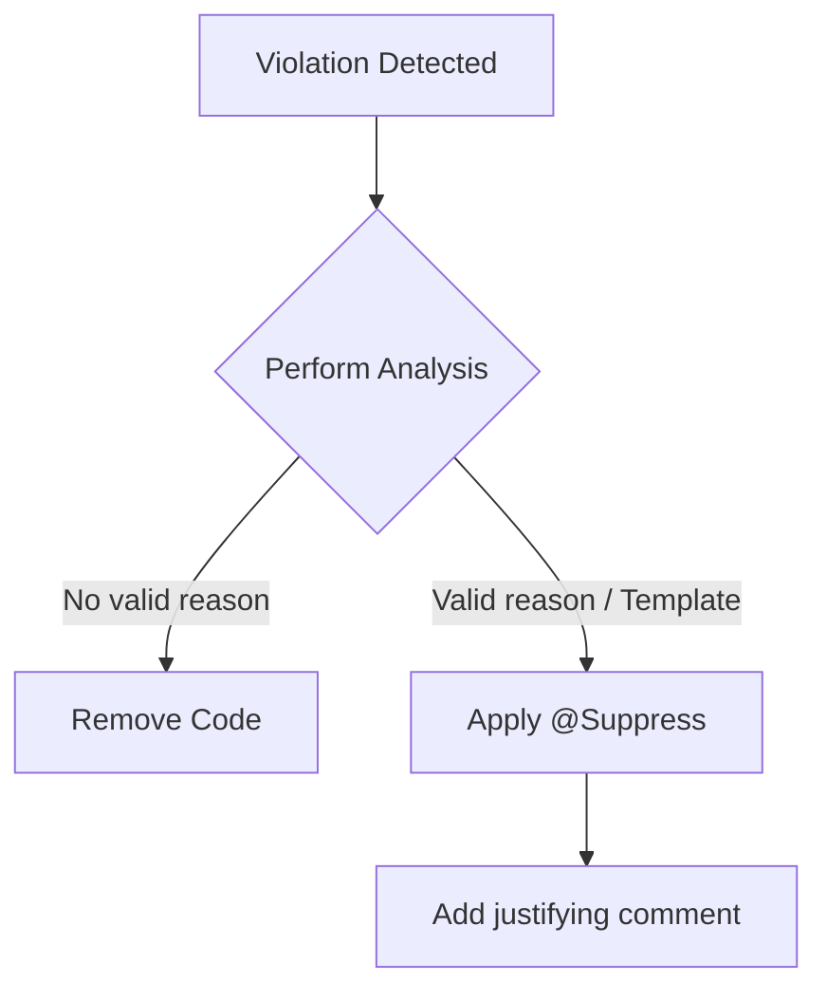

# Policy Model: Unused Code Enforcement

This document defines the conceptual model and policy for managing unused private members and properties in the Chimali project.

## Code Quality Policy

| Entity | Action | Condition |
|--------|--------|-----------|
| Unused Private Member | **Remove** | Default action for all discovered violations. |
| Unused Private Property | **Remove** | Default action for all discovered violations. |
| Intentional Unused Code | **Suppress** | Permitted ONLY if accompanied by a justifying comment or if required by a template/framework. |
| Generated Code | **Exclude** | Automatically ignored if located in `**/build/**` or `**/generated/**`. |

## State Transitions

