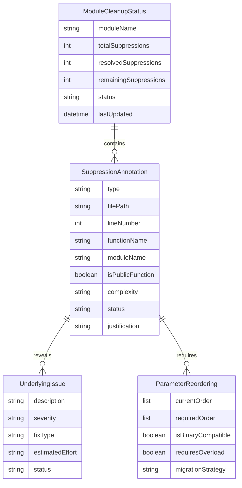

# Data Model: Compose Rule Enforcement

**Feature**: Compose Rule Enforcement  
**Date**: 2026-04-27  
**Purpose**: Define entities and relationships for code cleanup process

## Entities

### SuppressionAnnotation
Represents a `@Suppress` annotation found in the codebase that needs to be evaluated and potentially removed.

**Fields**:
- `type`: String - The specific suppression type (e.g., "LambdaParameterInRestartableEffect", "ComposableParamOrder")
- `filePath`: String - Absolute path to the file containing the suppression
- `lineNumber`: Int - Line number where the suppression is located
- `functionName`: String - Name of the function or composable containing the suppression
- `moduleName`: String - Module where the suppression is found (e.g., "feature:fido2", "core:common")
- `isPublicFunction`: Boolean - Whether the affected function is part of the public API
- `complexity`: String - Complexity level ("simple", "moderate", "complex")
- `status`: String - Current status ("pending", "in_progress", "resolved", "requires_manual_review")
- `justification`: String? - Documentation for cases where suppression cannot be removed

**Relationships**:
- Has many `UnderlyingIssue` (issues revealed when suppression is removed)
- Has many `ParameterReordering` (for ComposableParamOrder cases)

### UnderlyingIssue
Represents a code issue that was hidden by a suppression annotation.

**Fields**:
- `description`: String - Description of the underlying issue
- `severity`: String - Severity level ("error", "warning", "info")
- `fixType`: String - Type of fix needed ("parameter_rename", "refactor", "restructure")
- `estimatedEffort`: String - Effort to fix ("low", "medium", "high")
- `status`: String - Fix status ("pending", "fixed", "requires_expert_review")

**Relationships**:
- Belongs to `SuppressionAnnotation`

### ParameterReordering
Represents parameter reordering needed for ComposableParamOrder violations.

**Fields**:
- `currentOrder`: List<String> - Current parameter order
- `requiredOrder`: List<String> - Required parameter order following Compose conventions
- `isBinaryCompatible`: Boolean - Whether reordering breaks binary compatibility
- `requiresOverload`: Boolean - Whether an overload method is needed for compatibility
- `migrationStrategy`: String - Strategy for safe reordering ("direct", "overload", "deprecation")

**Relationships**:
- Belongs to `SuppressionAnnotation`

### ModuleCleanupStatus
Tracks cleanup progress for each module in the project.

**Fields**:
- `moduleName`: String - Module name (e.g., "feature:fido2", "core:data")
- `totalSuppressions`: Int - Total number of suppressions found
- `resolvedSuppressions`: Int - Number of suppressions successfully resolved
- `remainingSuppressions`: Int - Number of suppressions still pending
- `status`: String - Module status ("not_started", "in_progress", "completed", "blocked")
- `lastUpdated`: DateTime - Last time status was updated

**Relationships**:
- Has many `SuppressionAnnotation`

## Validation Rules

### SuppressionAnnotation Validation
- `type` must be one of the target suppression types
- `filePath` must exist in the project
- `lineNumber` must be positive
- `functionName` cannot be empty
- `moduleName` must correspond to a valid project module
- `complexity` must be "simple", "moderate", or "complex"

### UnderlyingIssue Validation
- `description` cannot be empty
- `severity` must be "error", "warning", or "info"
- `fixType` must be valid fix category
- `estimatedEffort` must be "low", "medium", or "high"

### ParameterReordering Validation
- `currentOrder` and `requiredOrder` cannot be empty
- Both lists must contain the same parameters (just reordered)
- `migrationStrategy` must be "direct", "overload", or "deprecation"

## State Transitions

### SuppressionAnnotation Status Flow
```
pending → in_progress → resolved
    ↓           ↓
requires_manual_review → resolved
```

### UnderlyingIssue Status Flow
```
pending → fixed
    ↓
requires_expert_review → fixed
```

### ModuleCleanupStatus Status Flow
```
not_started → in_progress → completed
    ↓           ↓
blocked → in_progress
```

## Data Relationships



## Reporting Metrics

### Cleanup Progress
- Total suppressions found across all modules
- Percentage of suppressions resolved
- Breakdown by suppression type
- Breakdown by module

### Quality Metrics
- Number of underlying issues identified and fixed
- Number of functions with proper parameter ordering
- Reduction in Detekt warnings
- Code complexity improvements

### Risk Metrics
- Number of binary compatibility issues identified
- Number of cases requiring manual expert review
- Estimated effort remaining for completion
