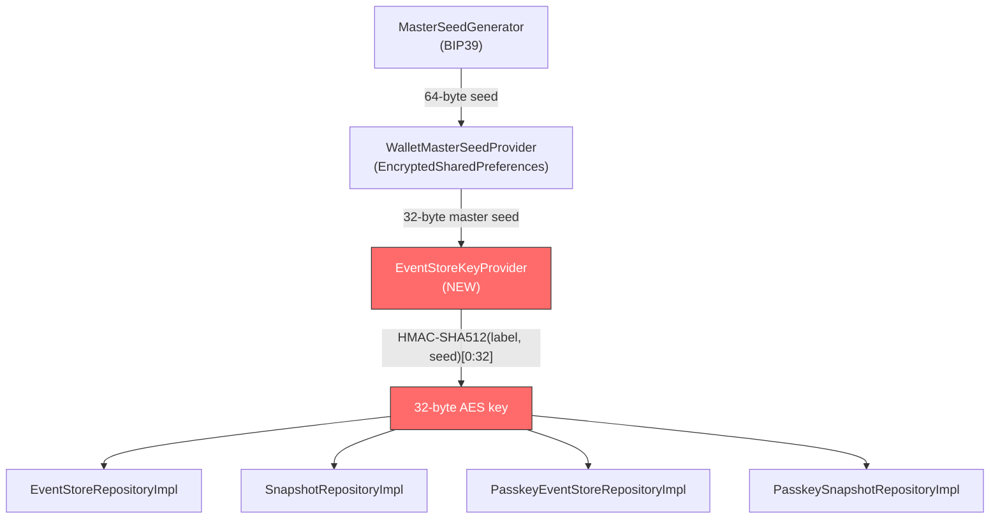

# Analysis: Missing Encryption Key Management for Event Store & Snapshot Repositories

**Feature**: 034-refactor-event-sourcing  
**Date**: 2026-05-13  
**Status**: Gap Analysis — No code changes  
**Relates to**: T032 (Verify AES-256-GCM encryption is correctly applied)

---

## 1. Problem Statement

All four event sourcing repository implementations currently use a **zero-filled `ByteArray(32)`** as the AES-256-GCM encryption key for event and snapshot payloads. This was originally a placeholder (marked with `TODO` comments that have since been replaced with named constants to satisfy Detekt). The underlying security gap remains: **no real key material is being used**.

```kotlin
// Current pattern in all 4 files:
private val dummyKey = ByteArray(KEY_SIZE) { 0 }
// ...
val encryptedPayload = encryptionManager.encrypt(payloadJson.encodeToByteArray(), dummyKey)
```

A zero-filled key provides **zero cryptographic security**. Any actor with read access to the SQLite database files can trivially decrypt all event and snapshot payloads by using the same all-zero key.

---

## 2. Affected Files & Call Sites

| # | File | Module | Call Sites |
|---|------|--------|------------|
| 1 | `EventStoreRepositoryImpl.kt` | `core:data` | `append()` L54, `getEvents()` L78, `getEventsFrom()` L92 |
| 2 | `SnapshotRepositoryImpl.kt` | `core:data` | `save()` L51, `getLatest()` L75 |
| 3 | `PasskeyEventStoreRepositoryImpl.kt` | `feature:fido2` | `append()` L52, `getEvents()` L75, `getEventsFrom()` L89 |
| 4 | `PasskeySnapshotRepositoryImpl.kt` | `feature:fido2` | `save()` L49, `getLatest()` L73 |

**Total**: 4 files, 10 encrypt/decrypt call sites, all using `dummyKey`.

---

## 3. Spec & Contract Requirements

The following spec artifacts explicitly mandate real AES-256-GCM encryption:

| Source | Requirement |
|--------|-------------|
| `spec.md` L142 | *"Event payloads and snapshots are serialized as JSON strings using Kotlin Serialization before being encrypted with **AES-256-GCM**."* |
| `spec.md` L96 | **FR-012**: *"System MUST utilize Kotlin Serialization (JSON) for the raw payload of events and snapshots **before encryption**."* |
| `plan.md` L20 | *"All event payloads encrypted with **AES-256-GCM** before storage."* |
| `plan.md` L29 | Constitution §I check: *"Event payloads encrypted AES-256-GCM before storage."* |
| `event-store-contract.md` L79 | *"Event payloads MUST be encrypted with **AES-256-GCM** before storage."* |
| `event-store-contract.md` L116 | *"Snapshot state MUST be encrypted with **AES-256-GCM** before storage."* |

> **CAUTION**: The `AesEncryptionManager` implementation correctly uses `AES/GCM/NoPadding` with random 12-byte IVs and 128-bit tags. The cryptographic mechanism is sound — only the **key source** is broken.

---

## 4. Existing Security Infrastructure

The project already has a mature key management stack that can be leveraged:

### 4.1. EncryptionManager (used, but with wrong key)

```
core/security/src/commonMain/.../api/EncryptionManager.kt    — interface
core/security/src/androidMain/.../impl/AesEncryptionManager.kt — AES/GCM/NoPadding impl
```

The `AesEncryptionManager` accepts a raw `ByteArray` key. It does **not** source the key itself — the caller is responsible for providing it.

### 4.2. MasterSeedGenerator (BIP39)

```
core/security/src/commonMain/.../api/MasterSeedGenerator.kt  — interface
core/security/src/androidMain/.../impl/Bip39MasterSeedGenerator.kt — PBKDF2-SHA512 impl
```

Generates and derives a 64-byte master seed from a BIP39 mnemonic. Already fully functional and persisted via `EncryptedSharedPreferences`.

### 4.3. WalletMasterSeedProvider (BIP-85 key derivation)

```
feature/fido2/src/androidMain/.../crypto/WalletMasterSeedProvider.kt
```

Demonstrates the project's established pattern for **deterministic key derivation** from the master seed:
- Uses `HMAC-SHA512` with domain-specific labels (e.g., `"chimali_device_key_v1"`)
- Uses BIP-85 hardened child key derivation for cryptographic isolation
- Cached in memory with mutex-guarded lazy initialization

### 4.4. SQLCipher File-Level Encryption (VaultDatabase only)

The VaultDatabase already has file-level SQLCipher encryption. The AES-256-GCM payload encryption is a **defense-in-depth** layer — not the sole encryption mechanism for the Vault module. However, for Fido2Database (which is a plain KMP SQLDelight database without SQLCipher), the payload encryption is the **primary** data-at-rest protection.

---

## 5. Security Impact Assessment

| Aggregate | Database | File-Level Encryption | Payload Encryption Status | Risk |
|-----------|----------|-----------------------|---------------------------|------|
| VaultEntry | VaultDatabase | ✅ SQLCipher | ❌ Zero-key (dummy) | **Medium** — SQLCipher provides defense, but event payload encryption adds nothing |
| PasskeyCredential | Fido2Database | ❌ None | ❌ Zero-key (dummy) | **High** — No real encryption at any layer for event/snapshot payloads |

> **WARNING**: The Fido2Database (Passkey aggregate) has **no file-level encryption** and the current dummy key means event payloads containing FIDO2 credential state (public keys, user names, sign counts, RP IDs) are stored effectively **in plaintext**.

---

## 6. What's Missing

### 6.1. EventStoreKeyProvider — A Key Source for Event Sourcing

There is **no component** in the codebase that derives or provides the AES-256-GCM key material specifically for the event store. This is the core missing feature.

**What it needs to do:**
1. Derive a deterministic 32-byte AES-256 key from the existing master seed
2. Use a domain-specific derivation label to ensure cryptographic isolation from FIDO2 keys
3. Be accessible from both `core:data` (Vault) and `feature:fido2` (Passkey) modules
4. Support key caching (the master seed is already cached in `WalletMasterSeedProvider`)
5. Handle the case where the master seed is not yet initialized (first launch)

### 6.2. Key Derivation Strategy (Not Yet Decided)

There are multiple viable approaches:

| Option | Mechanism | Pros | Cons |
|--------|-----------|------|------|
| **A. HKDF from master seed** | `HKDF-SHA256(masterSeed, info="chimali_eventstore_v1")` → 32 bytes | Standard, clean isolation, used by industry | Requires HKDF implementation (BouncyCastle has one) |
| **B. HMAC-SHA512 derivation** | `HMAC-SHA512("chimali_eventstore_v1", masterSeed)[0:32]` | Matches existing pattern in `WalletMasterSeedProvider` | Slightly non-standard for key derivation (but practical) |
| **C. BIP-85 child derivation** | New hardened path: `m/83696968'/83286642'/3'` (index=3 for ES branch) | Full isolation from ECDSA and PQ branches | Heavier machinery than needed; BIP-85 is designed for seed extraction, not symmetric keys |
| **D. Android Keystore** | AES key stored in hardware-backed Keystore | Hardware protection | Android-only; breaks KMP commonMain placement of Fido2 repositories |
| **E. Per-aggregate key** | Derive a unique key per `aggregateId` | Maximum isolation | Unnecessary complexity; single ES key is sufficient |

> **RECOMMENDATION**: Option **B** (HMAC-SHA512 derivation) is the pragmatic choice. It matches the existing codebase pattern established by `WalletMasterSeedProvider.deriveDeviceKeyPair()` and requires no new dependencies.

### 6.3. Module Boundary Challenge

The event store key must be accessible from:
- `core:data` (for `EventStoreRepositoryImpl` and `SnapshotRepositoryImpl`)
- `feature:fido2` (for `PasskeyEventStoreRepositoryImpl` and `PasskeySnapshotRepositoryImpl`)

Currently, the `WalletMasterSeedProvider` lives in `feature:fido2` and is Android-specific. The key provider would likely need to be:
- **Interface** in `core:security` (commonMain) or `core:domain` (commonMain)
- **Implementation** in `core:security` (androidMain) or a shared provider

### 6.4. Data Migration Consideration

Changing the encryption key from `ByteArray(32) { 0 }` to a real key will make all **existing event and snapshot data unreadable**. This requires either:
1. **Truncation**: Clear all event and snapshot tables (acceptable in pre-production per spec)
2. **Re-encryption migration**: Read with old key, write with new key (more complex)
3. **Schema version bump**: SQLDelight migration that truncates the EventStore and Snapshot tables

---

## 7. Relationship to Open Tasks

This analysis directly relates to the following open tasks in `tasks.md`:

| Task | Description | Status | Impact |
|------|-------------|--------|--------|
| T032 | Verify AES-256-GCM encryption is correctly applied to all persisted event and snapshot payloads | ❌ Open | **Blocked** — Cannot verify until real keys are in place |
| T031 | Run local-ci.ps1 to ensure all tests pass | ❌ Open | No impact on compilation; tests pass with dummy key |

> **NOTE**: T032 cannot be meaningfully completed until the dummy key is replaced with a properly derived key. The task should be expanded or a new prerequisite task created.

---

## 8. Proposed Implementation Outline



### Proposed Interface

```kotlin
// core/domain (or core/security) — commonMain
interface EventStoreKeyProvider {
    /**
     * Returns the 32-byte AES-256 key for encrypting/decrypting
     * event and snapshot payloads.
     *
     * @throws IllegalStateException if the master seed has not been initialized.
     */
    suspend fun getEventStoreKey(): ByteArray
}
```

### Proposed Changes per File

| File | Current | Proposed |
|------|---------|----------|
| `EventStoreRepositoryImpl` | `dummyKey` field | Inject `EventStoreKeyProvider`, call `getEventStoreKey()` |
| `SnapshotRepositoryImpl` | `dummyKey` field | Inject `EventStoreKeyProvider`, call `getEventStoreKey()` |
| `PasskeyEventStoreRepositoryImpl` | `dummyKey` field | Inject `EventStoreKeyProvider`, call `getEventStoreKey()` |
| `PasskeySnapshotRepositoryImpl` | `dummyKey` field | Inject `EventStoreKeyProvider`, call `getEventStoreKey()` |
| DI modules | N/A | Register `EventStoreKeyProvider` singleton |
| Tests | `mockk(relaxed = true)` | Mock `EventStoreKeyProvider` to return a test key |

---

## 9. Open Questions

1. **Should Vault and Passkey aggregates use the same key or separate keys?**
   - Same key is simpler; separate keys provide better isolation if one database is compromised.

2. **Where should `EventStoreKeyProvider` live?**
   - `core:security` (commonMain) is the natural home, but the implementation requires access to `MasterSeedProvider` which is currently in `feature:fido2`.
   - Alternative: `core:domain` for the interface, `core:data` for the implementation.

3. **What happens if `getEventStoreKey()` is called before the master seed is initialized?**
   - Fail loudly (`IllegalStateException`)? Return a `Result`? Block until seed is available?

4. **Data truncation strategy for existing dummy-encrypted data?**
   - SQLDelight migration to clear EventStore + Snapshot tables is the simplest path and is consistent with the spec's truncation strategy.
