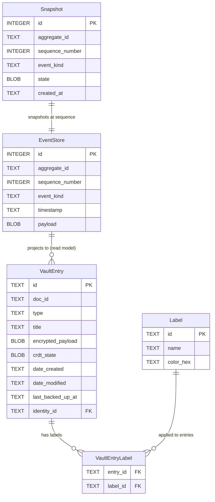
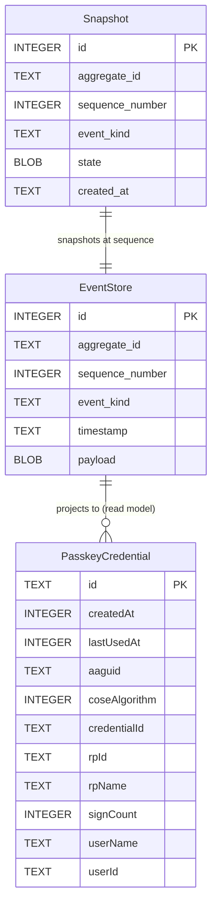
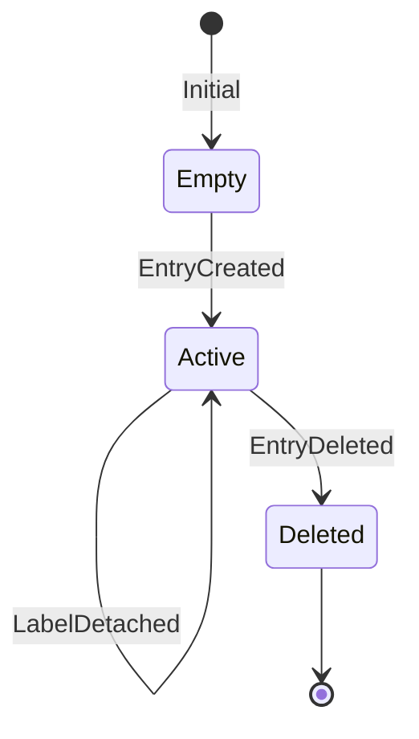
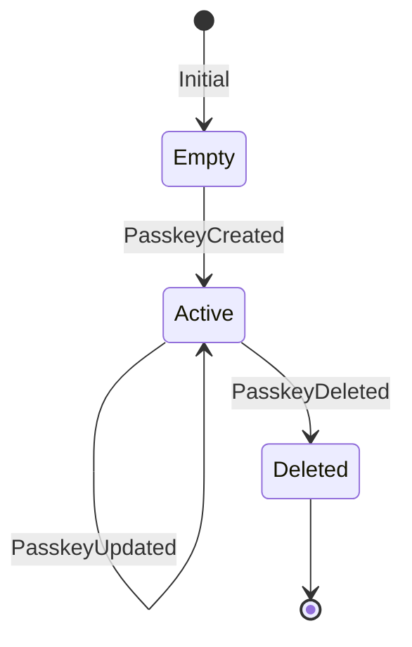

# Data Model: Event Sourcing Architecture

**Feature**: 034-refactor-event-sourcing
**Date**: 2026-05-12 (updated with clarification results)

## Core Domain Entities

### 1. DomainEvent (Base Sealed Interface)

The root type for all domain events. KMP `commonMain` compatible.

```kotlin
@Serializable
sealed interface DomainEvent {
    val aggregateId: String
    val sequenceNumber: Long
    val timestamp: Instant
    val eventKind: EventKind
}
```

**Fields**:
- `aggregateId: String` — Unique identifier of the aggregate root (e.g., VaultEntry UUID).
- `sequenceNumber: Long` — Monotonically increasing per-aggregate counter. Enforces ordering and optimistic concurrency.
- `timestamp: Instant` — `kotlinx-datetime` timestamp of when the event occurred.
- `eventKind: EventKind` — Discriminator for the event family (Vault, Passkey, etc.).

**Validation**:
- `aggregateId` MUST NOT be blank.
- `sequenceNumber` MUST be ≥ 1.

---

### 2. EventKind (Enum)

```kotlin
@Serializable
enum class EventKind {
    VAULT_EVENT,
    PASSKEY_EVENT,
}
```

Maps to `EventSourcingModule.fs` → `type EventKind = VaultEvent | PasskeyEvent | Claim`.

---

### 3. VaultEvent (Sealed Interface)

Derived from `EventSourcingModule.fs` §2 (lines 20-26):

```kotlin
@Serializable
sealed interface VaultEvent : DomainEvent {
    @Serializable
    @SerialName("vault.entry_created")
    data class EntryCreated(
        override val aggregateId: String,
        override val sequenceNumber: Long,
        override val timestamp: Instant,
        val docId: String,
        val title: String,
        val encryptedPayload: ByteArray,
        val crdtState: ByteArray,
        val identityId: String,
    ) : VaultEvent { override val eventKind = EventKind.VAULT_EVENT }

    @Serializable
    @SerialName("vault.entry_updated")
    data class EntryUpdated(
        override val aggregateId: String,
        override val sequenceNumber: Long,
        override val timestamp: Instant,
        val title: String,
        val encryptedPayload: ByteArray,
        val crdtState: ByteArray,
    ) : VaultEvent { override val eventKind = EventKind.VAULT_EVENT }

    @Serializable
    @SerialName("vault.label_attached")
    data class LabelAttached(
        override val aggregateId: String,
        override val sequenceNumber: Long,
        override val timestamp: Instant,
        val labelId: String,
    ) : VaultEvent { override val eventKind = EventKind.VAULT_EVENT }

    @Serializable
    @SerialName("vault.label_detached")
    data class LabelDetached(
        override val aggregateId: String,
        override val sequenceNumber: Long,
        override val timestamp: Instant,
        val labelId: String,
    ) : VaultEvent { override val eventKind = EventKind.VAULT_EVENT }

    @Serializable
    @SerialName("vault.entry_deleted")
    data class EntryDeleted(
        override val aggregateId: String,
        override val sequenceNumber: Long,
        override val timestamp: Instant,
    ) : VaultEvent { override val eventKind = EventKind.VAULT_EVENT }
}
```

---

### 4. PasskeyEvent (Sealed Interface)

Derived from `EventSourcingModule.fs` §2 (lines 28-31):

```kotlin
@Serializable
sealed interface PasskeyEvent : DomainEvent {
    @Serializable
    @SerialName("passkey.created")
    data class PasskeyCreated(
        override val aggregateId: String,
        override val sequenceNumber: Long,
        override val timestamp: Instant,
        val credentialId: String,
        val aaguid: String,
        val coseAlgorithm: Int,
        val rpId: String,
        val rpName: String,
        val signCount: Long,
        val userDisplayName: String,
        val userId: String,
        val userName: String,
    ) : PasskeyEvent { override val eventKind = EventKind.PASSKEY_EVENT }

    @Serializable
    @SerialName("passkey.updated")
    data class PasskeyUpdated(
        override val aggregateId: String,
        override val sequenceNumber: Long,
        override val timestamp: Instant,
        val signCount: Long,
    ) : PasskeyEvent { override val eventKind = EventKind.PASSKEY_EVENT }

    @Serializable
    @SerialName("passkey.deleted")
    data class PasskeyDeleted(
        override val aggregateId: String,
        override val sequenceNumber: Long,
        override val timestamp: Instant,
    ) : PasskeyEvent { override val eventKind = EventKind.PASSKEY_EVENT }
}
```

---

### 5. VaultCommand (Sealed Interface)

Derived from `EventSourcingModule.fs` §3 (lines 34-38, 134-146):

```kotlin
sealed interface VaultCommand {
    val identityId: String

    data class CreateEntry(
        val id: String,
        override val identityId: String,
        val docId: String,
        val title: String,
        val encryptedPayload: ByteArray,
        val crdtState: ByteArray,
    ) : VaultCommand

    data class UpdateContent(
        val aggregateId: String,
        override val identityId: String,
        val title: String,
        val encryptedPayload: ByteArray,
        val crdtState: ByteArray,
    ) : VaultCommand

    data class AddLabel(
        val aggregateId: String,
        override val identityId: String,
        val labelId: String,
    ) : VaultCommand

    data class RemoveLabel(
        val aggregateId: String,
        override val identityId: String,
        val labelId: String,
    ) : VaultCommand

    data class DeleteEntry(
        val aggregateId: String,
        override val identityId: String,
    ) : VaultCommand
}
```

---

### 6. PasskeyCommand (Sealed Interface)

```kotlin
sealed interface PasskeyCommand {
    data class CreatePasskey(
        val id: String,
        val credentialId: String,
        val aaguid: String,
        val coseAlgorithm: Int,
        val rpId: String,
        val rpName: String,
        val signCount: Long,
        val userDisplayName: String,
        val userId: String,
        val userName: String,
    ) : PasskeyCommand

    data class UpdateSignCount(
        val aggregateId: String,
        val signCount: Long,
    ) : PasskeyCommand

    data class DeletePasskey(
        val aggregateId: String,
    ) : PasskeyCommand
}
```

---

### 7. VaultState (Aggregate Root State)

The write-model state reconstructed by folding events. Maps to `EventSourcingModule.fs` §1 (lines 6-17):

```kotlin
data class VaultState(
    val id: String = "",
    val docId: String = "",
    val title: String = "",
    val encryptedPayload: ByteArray = byteArrayOf(),
    val crdtState: ByteArray = byteArrayOf(),
    val labels: Set<String> = emptySet(),
    val isDeleted: Boolean = false,
    val identityId: String = "",
) {
    companion object {
        val EMPTY = VaultState()
    }
}
```

---

### 8. PasskeyState (Aggregate Root State)

```kotlin
data class PasskeyState(
    val id: String = "",
    val credentialId: String = "",
    val aaguid: String = "",
    val coseAlgorithm: Int = -7,
    val rpId: String = "",
    val rpName: String = "",
    val signCount: Long = 0,
    val userDisplayName: String = "",
    val userId: String = "",
    val userName: String = "",
    val isDeleted: Boolean = false,
) {
    companion object {
        val EMPTY = PasskeyState()
    }
}
```

---

### 9. Trace (Audit Log)

The audit trace is generated during state reconstruction and returned as a structured JSON array of entries.

```kotlin
@Serializable
data class TraceEntry(
    val timestamp: Instant,
    val description: String,
    val eventType: String,
    val metadata: Map<String, String> = emptyMap(),
)
```

---

### 10. Snapshot\<T\>

Maps to `EventSourcingModule.fs` snapshot structures (lines 157-160):

```kotlin
@Serializable
data class Snapshot<T>(
    val aggregateId: String,
    val sequenceNumber: Long,
    val state: T,
    val createdAt: Instant,
)
```

---

## SQL Schema

### VaultDatabase (core:database) — EventStore + Snapshot Tables

Added to `Vault.sq` alongside existing tables:

```sql
-- Event Store (append-only, immutable)
CREATE TABLE EventStore (
    id INTEGER NOT NULL PRIMARY KEY AUTOINCREMENT,
    aggregate_id TEXT NOT NULL,
    sequence_number INTEGER NOT NULL,
    event_kind TEXT NOT NULL,
    timestamp TEXT NOT NULL,
    payload BLOB NOT NULL,
    UNIQUE(aggregate_id, sequence_number)
);

CREATE INDEX idx_event_store_aggregate
    ON EventStore(aggregate_id, sequence_number);

CREATE INDEX idx_event_store_timestamp
    ON EventStore(aggregate_id, timestamp);

-- Snapshot (upsert: latest per aggregate+kind)
CREATE TABLE Snapshot (
    id INTEGER NOT NULL PRIMARY KEY AUTOINCREMENT,
    aggregate_id TEXT NOT NULL,
    sequence_number INTEGER NOT NULL,
    event_kind TEXT NOT NULL,
    state BLOB NOT NULL,
    created_at TEXT NOT NULL,
    UNIQUE(aggregate_id, event_kind)
);
```

### Fido2Database (feature:fido2) — EventStore + Snapshot Tables

Added to `Fido2Database.sq` alongside existing tables:

```sql
-- Event Store (append-only, immutable)
CREATE TABLE EventStore (
    id INTEGER NOT NULL PRIMARY KEY AUTOINCREMENT,
    aggregate_id TEXT NOT NULL,
    sequence_number INTEGER NOT NULL,
    event_kind TEXT NOT NULL,
    timestamp TEXT NOT NULL,
    payload BLOB NOT NULL,
    UNIQUE(aggregate_id, sequence_number)
);

CREATE INDEX idx_fido2_event_store_aggregate
    ON EventStore(aggregate_id, sequence_number);

CREATE INDEX idx_fido2_event_store_timestamp
    ON EventStore(aggregate_id, timestamp);

-- Snapshot (upsert: latest per aggregate+kind)
CREATE TABLE Snapshot (
    id INTEGER NOT NULL PRIMARY KEY AUTOINCREMENT,
    aggregate_id TEXT NOT NULL,
    sequence_number INTEGER NOT NULL,
    event_kind TEXT NOT NULL,
    state BLOB NOT NULL,
    created_at TEXT NOT NULL,
    UNIQUE(aggregate_id, event_kind)
);
```

**Notes (both databases)**:
- `payload` is a `BLOB` containing AES-256-GCM encrypted JSON of the serialized event.
- `UNIQUE(aggregate_id, sequence_number)` enforces append-only ordering and optimistic concurrency.
- `event_kind` is stored as `TEXT` for queryability (e.g., filtering by `VAULT_EVENT` or `PASSKEY_EVENT`).
- `UNIQUE(aggregate_id, event_kind)` on Snapshot means only the latest snapshot per aggregate+kind is kept (upsert on save).
- `state` is AES-256-GCM encrypted JSON of the serialized aggregate state.
- `idx_*_event_store_timestamp` index added for temporal query performance (FR-005).

---

## Entity Relationships

### VaultDatabase (Vault Aggregate)



### Fido2Database (Passkey Aggregate)



## State Transitions

### VaultEntry Aggregate



### PasskeyCredential Aggregate


